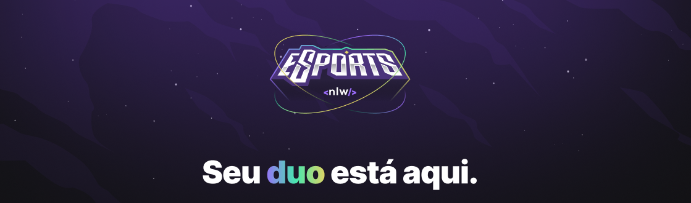
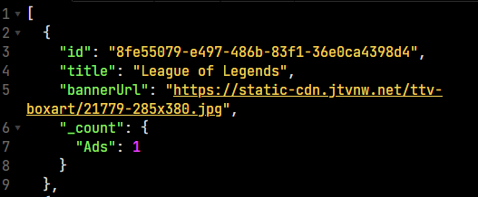

<h1 align="center">
  
  
NLW ESPORTS | BACKEND

</h1>

<h2> O que é esse projeto? </h2>

 
  NLW ESPORTS  é uma aplicação com o intuito de conectar usuários que 
  desejam encontrar parceiros em jogos online. Através dele é possível
  criar e consumir anúncios para que outros usuários entre em contanto.

  

## A aplicação é composta em 3 partes:

- [Backend](https://github.com/Th-Fernandes/NLW-ESPORTS-BACKEND)
- [Versão Web](https://github.com/Th-Fernandes/NLW-ESPORTS-WEB)
- [Versão Mobile](https://github.com/Th-Fernandes/NLW-ESPORTS-MOBILE)
 

  <h2>Ferramentas utilizadas (versão backend)</h2>
  <ul>
    <li>Express</li>
    <li>Prisma</li>
    <li>Typescript</li>
  </ul>

## Autor

